# DigitroShop 🛒
**A Professional E-commerce Platform built with .NET 8, Clean Architecture, and CQRS.**

DigitroShop is a robust, full-featured online store and administration system. It is designed with a heavy focus on backend architecture, scalability, and secure role-based access control.

---

## 🚀 Key Architectural Highlights
This project is not just a shop; it's a demonstration of modern software engineering patterns:

*   **Clean Architecture:** Divided into 5 distinct layers (*Domain, Application, Infrastructure, Persistence, Presentation*) to ensure separation of concerns and maintainability.
*   **CQRS Pattern:** Command and Query Responsibility Segregation is used in the service layer to optimize data operations.
*   **Facade Pattern:** Implemented to simplify the interaction between controllers and complex service logic, making the codebase cleaner.
*   **Custom Authentication & Authorization:** Instead of using default Identity, I built a custom **Claims-based Cookie Authentication** system from scratch, including custom User, Role, and UserInRole management.
*   **Layered Validation:** Ensuring data integrity via **FluentValidation** on the server-side and **JavaScript/jQuery** on the client-side.

---

## 🛠 Tech Stack
*   **Framework:** .NET 8 (ASP.NET Core MVC & Razor Pages)
*   **Database:** Microsoft SQL Server
*   **ORM:** Entity Framework Core (Code First)
*   **Validation:** FluentValidation
*   **UI/Frontend:** Bootstrap, jQuery, JavaScript
*   **Tools:** LazZiya Pagination (Client-side)

---

## 📂 Project Structure
The project follows **Clean Architecture** principles:
- **Domain:** Core business entities and enums.
- **Application:** Service interfaces & implementations, Facade patterns, and CQRS use-cases. Data access is performed via an abstraction of DbContext.
- **Infrastructure:**  Reserved for external service integrations and cross-cutting concerns such as caching, logging, and messaging. Currently kept minimal in this project.
- **Persistence:** EF Core DbContext implementation, migrations, and database configuration.
- **Presentation:** MVC controllers, Razor Pages, ViewModels, and client-side assets responsible for user interaction.
---

## 🔑 Role-Based Access Control (RBAC)
The system manages permissions dynamically based on 3 specific roles:

1.  **Admin:** Full authority over the system. Can manage Users, Categories, Products, Sliders, and Site Settings.
2.  **Operator:** Restricted access. Can manage Products and Orders, but is **blocked** from Users and Categories.
3.  **Customer:** Access to the storefront, cart, and personal order history.

---

## 🌟 Features

### 🛒 Storefront (Client)
- **User Journey:** Custom Registration and Login system.
- **Product Discovery:** Advanced searching, filtering, and category-based browsing.
- **Shopping Cart:** Fully functional cart management.
- **Order Management:** View order history, payment status, and tracking details.
- **Pagination:** Smooth product listing using LazZiya library.

### ⚙️ Admin Dashboard
- **User Management:** Create (with specific roles), Edit, Delete, or Deactivate users.
- **Category Management:** Full CRUD operations for product hierarchy.
- **Product Management:** Complete control over inventory and product details.
- **Order Tracking:** Monitor all orders and update statuses (*Processing, Delivered, Canceled*).
- **Payment Logs:** View and audit all transaction details.
- **Content Management:** Manage homepage sliders and site banners.

---
## 📸 Screenshots

To give you a visual tour of **DigitroShop**, here are the previews of the User Interface and Admin Dashboard:

### 🛒 Storefront (Customer Perspective)

| Home Page 1 | Home Page 2 |
|:---:|:---:|
| 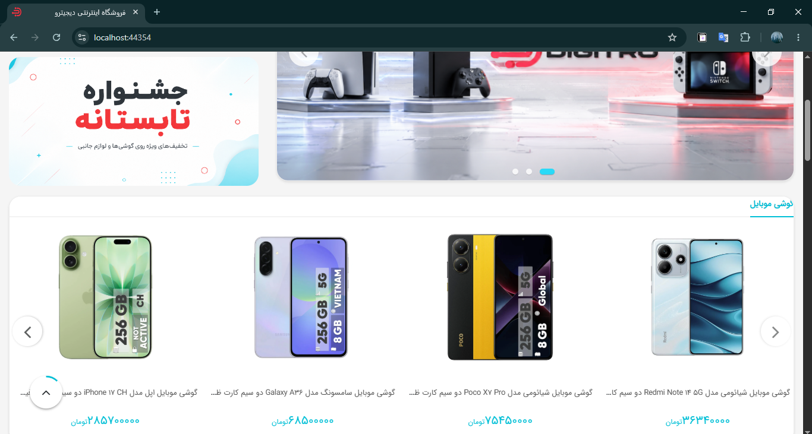 | 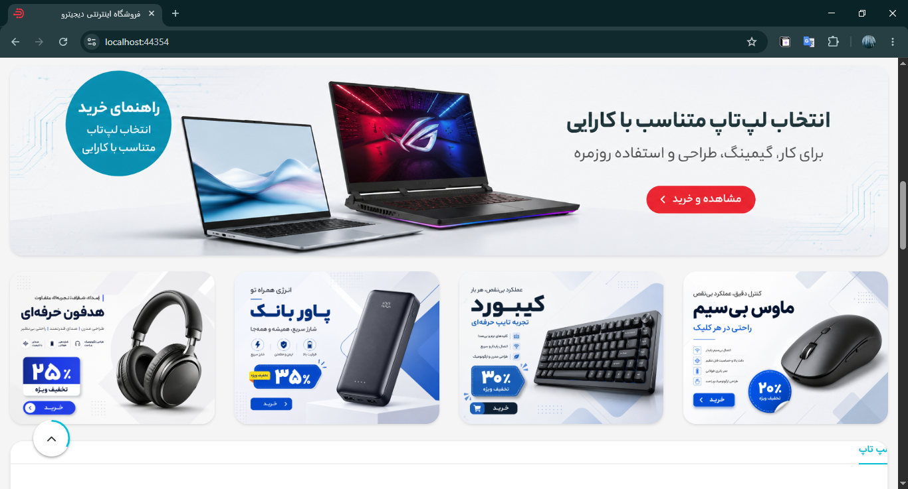 |

| Product Details | Shopping Cart |
|:---:|:---:|
| 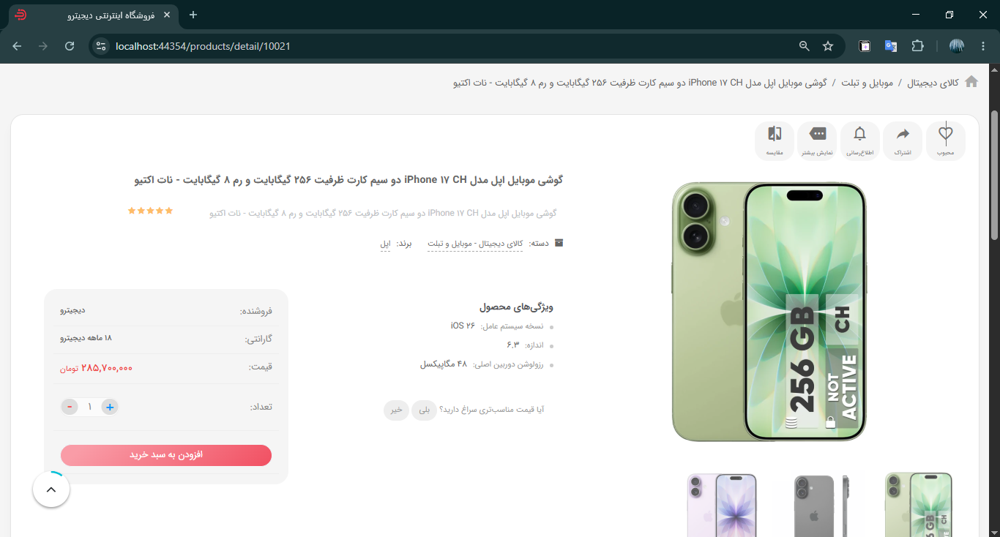 | 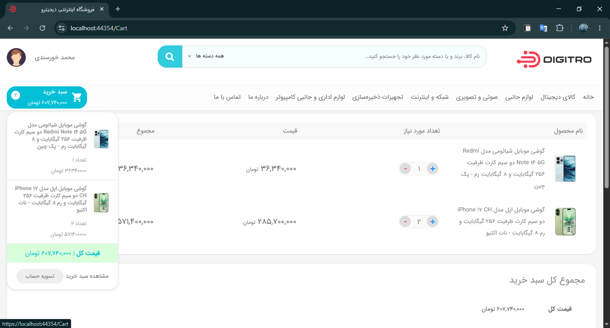 |

| Sign In | Sign Up |
|:---:|:---:|
| 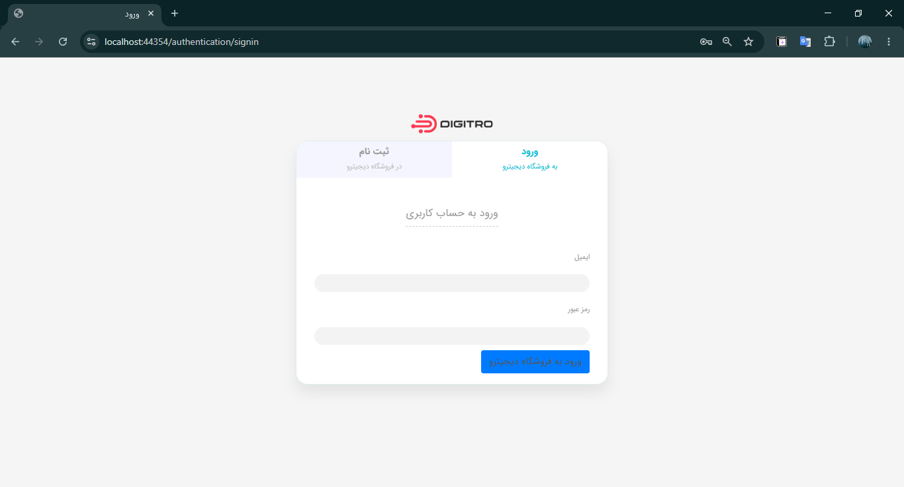 | 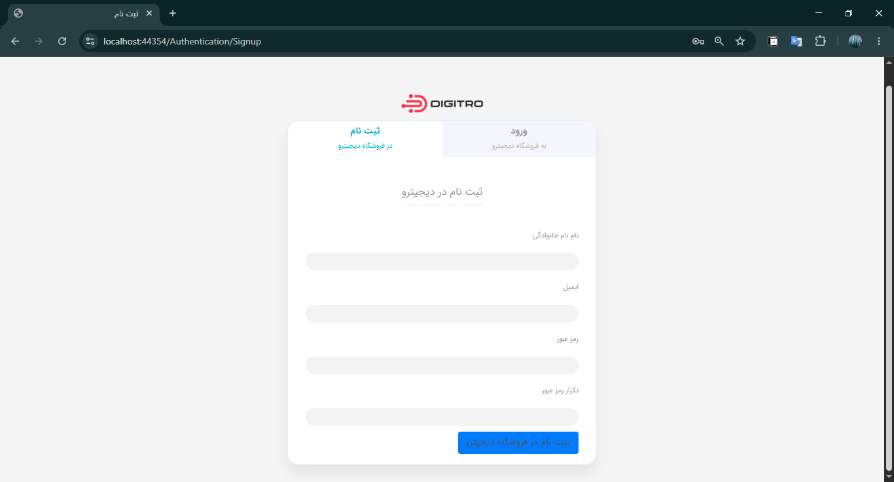 |

| Product List |
|:---:|
| 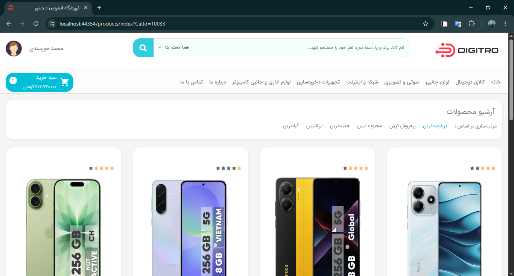 |

### ⚙️ Admin Dashboard (Management)

| Admin Overview | Order List |
|:---:|:---:|
| 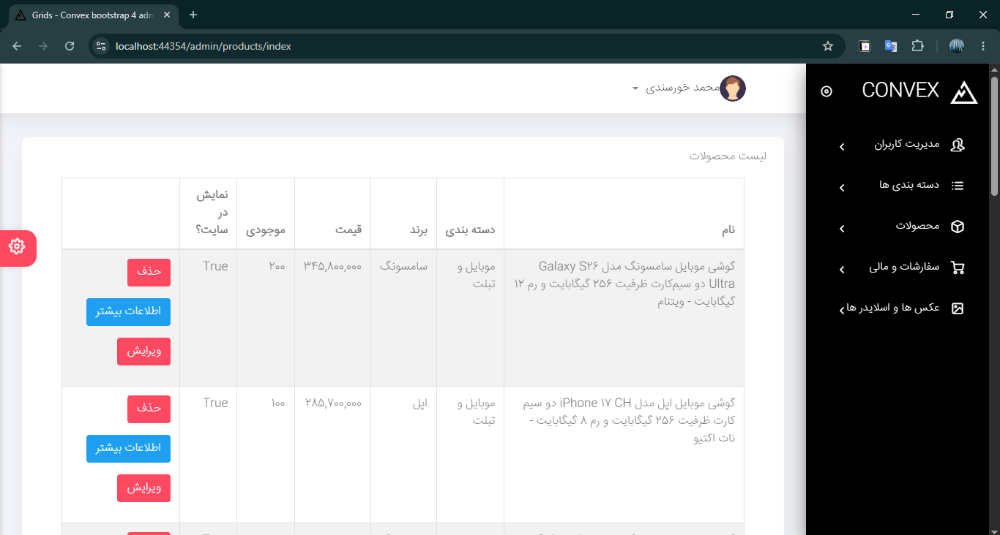 | 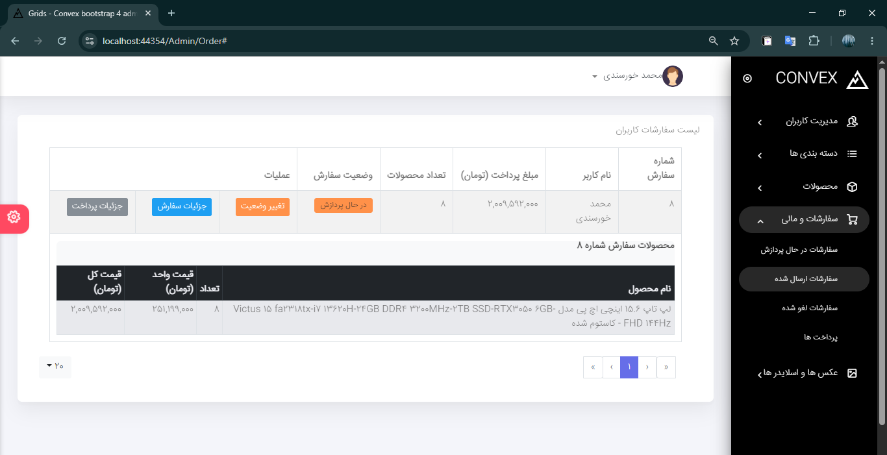 |

| Add Product | Edit Product |
|:---:|:---:|
| 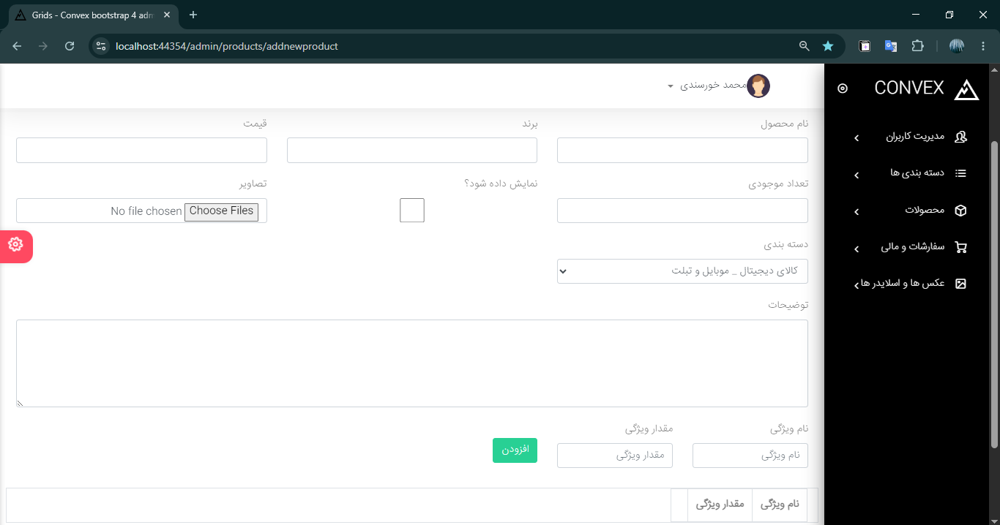 | 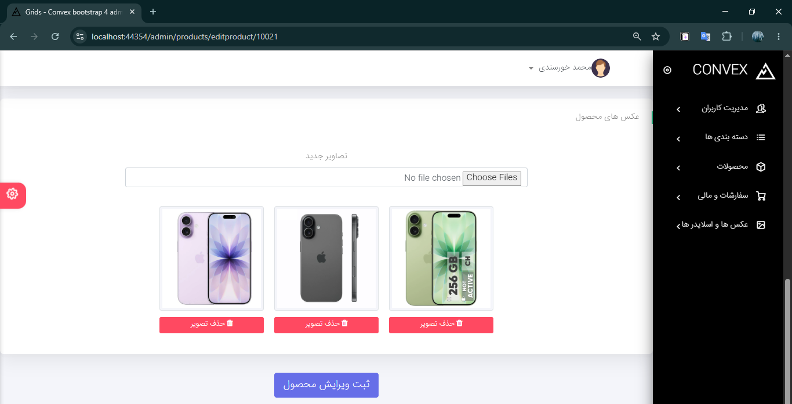 |

---
## 🔧 How to Run
1.  Clone the repository: `git clone https://github.com/severanceline/DigitroShop.git`
2.  Navigate to the `Persistence` layer and update the ConnectionString in `appsettings.json`.
3.  Run `Update-Database` in Package Manager Console.
4.  Build and Run the project.

---

## 👨‍💻 About This Project
This project was built to demonstrate practical experience with:
- Custom Security Implementations.
- Architectural Patterns (CQRS, Facade, Clean Arch).
- Data Integrity and Validation.
- Enterprise-level project structuring.

---
